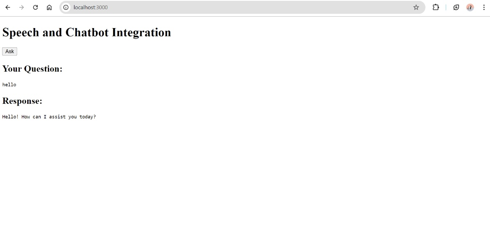

# voice-chatbot-integration

## Introduction
This project demonstrates how to integrate speech-to-text (STT), ChatGPT, and text-to-speech (TTS) into a Node.js application. The application allows users to speak a question, receive a text response from ChatGPT, and hear the response spoken aloud.

## Prerequisites
Before you begin, ensure you have the following:
- Node.js
- npm (Node package manager)
- A valid OpenAI API key

## Steps to Implement

### 1. Obtain OpenAI API Key

- **OpenAI API Key:** Sign up on the [OpenAI API website](https://platform.openai.com/account/api-keys) and generate an API key.

### 2. Setup Node.js Project

Initialize a new Node.js project and install the required packages:

```bash
npm install express axios dotenv
```

### 3. Coding in VS Code

- Server Setup: Create a server.js file to configure the Express server, integrate OpenAI, and handle API requests.
- STT and TTS Integration: Implement speech-to-text and text-to-speech functionalities. If not using Google Cloud, use an alternative text-to-speech library.

### 4. HTML and JavaScript

In the public/ folder:
- HTML: Create an index.html file with a form to submit questions and a button to start voice recording.
- JavaScript: Write script.js to handle form submissions, voice recording, and interactions with the server.

### 5. Running the Server

Start the server with:

```bash
npm start
```

### Example Output

Here are example screenshots demonstrating the application in action:



You can listen the Audio Recordings [here](one.mp3) for thes example.


You can listen the Audio Recordings [here](two.mp3) for thes example.
